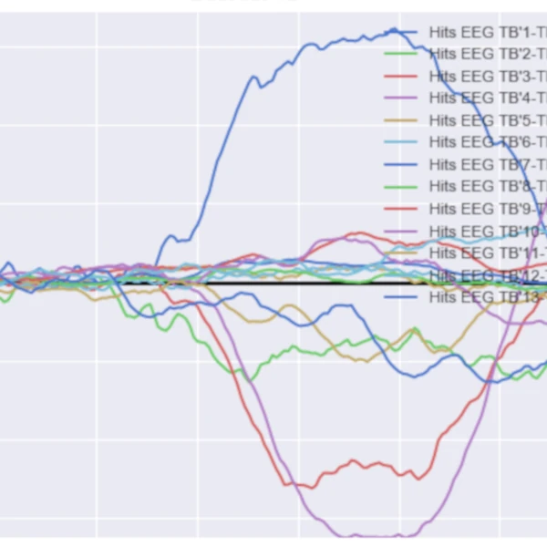
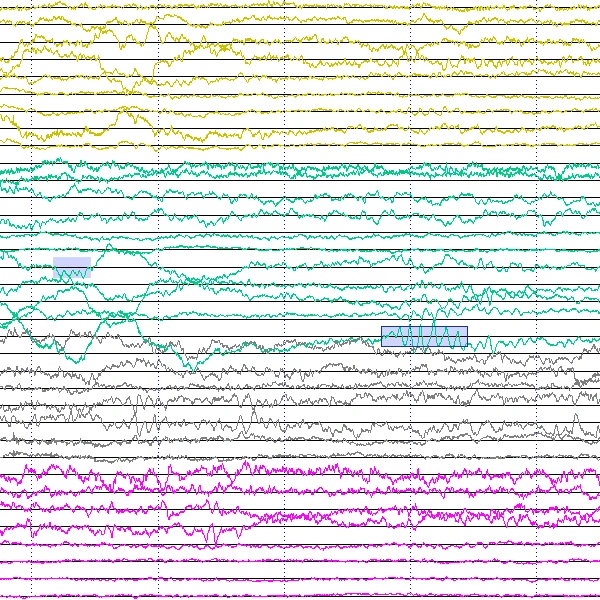
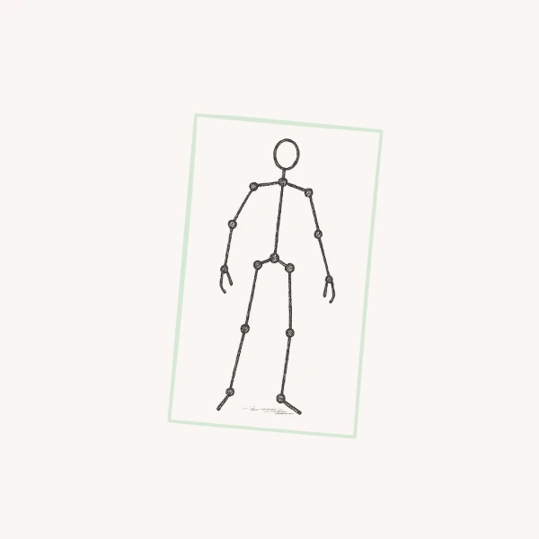

# Martin D. | Data Scientist - Computer Vision - Edge AI Engineer

Freelance data scientist with expertise in machine learning, signal processing, and full-stack development.

I’ve worked on intelligent sensor systems for healthcare, developing fall detection algorithms, optimizing AI models for embedded hardware, and building web/mobile applications for real-time monitoring. My research background at CNRS focused on EEG signal analysis, machine learning for epilepsy detection, and spiking neural network modeling. I also have experience as a freelance developer implementing computer vision algorithms and interactive applications.

My toolbox includes Python, PyTorch, web technologies (React Native, JavaScript), Docker, SQL, Git, and more. I enjoy designing efficient algorithms, turning raw data into insights, and building reliable systems from hardware to cloud.

## Open Projects

<table width="100%">
  <thead>
    <tr>
      <th width="25%">Project</th>
      <th width="75%">Description</th>
    </tr>
  </thead>
  <tbody>
    <tr>
      <td></td>
      <td><strong><a href="https://github.com/tinmarD/pySAB">PySAB Analysis</a></strong> pySAB was designed to analyse EEG recordings during the SAB experiment, where a participant tries to recognise previously seen images. The pySAB package include pre-processing steps, ERP analysis and decoding algorithms using SVMs. It helped in the investigation of the dynamics of the visual recognition as well as regions involved in the process.</td>
    </tr>
      <tr>
      <td></td>
      <td><strong><a href="https://github.com/tinmarD/simplecochlea">Simple Cochlea Model</a></strong>  The simplecochlea package was developped during the M4 ERC project, which investigated how the human brain learns and recognises visual and auditory stimuli. It is a basic cochlea model, converting an input sound into neural spikes. Later on, a Spike Timing Dependend Plasticity algorithm was used to learn in a unsupervised way repeating patterns in the input sound.</td>
    </tr>
     <tr>
      <td></td>
      <td><strong><a href="https://github.com/tinmarD/micMac">micMac Visualization Tool</a></strong> micMac was designed in the context of the EpiFaR project, to examine EEG/iEEG recordings in a simple and intuitive way. The first goal was to assist in the research of high frequency oscillations in intracerebral recording with both macro and micro contacts. It allows visualization in time, frequency or time frequency domains of multi-channels data and includes automatic detectors for certain epileptic events.</td>
    </tr>

  </tbody>
</table>

## Closed Projects

<table width="100%">
  <thead>
    <tr>
      <th width="25%">Project</th>
      <th width="75%">Description</th>
    </tr>
  </thead>
  <tbody>
    <tr>
      <td></td>
      <td><strong>Fall Detection System</strong> Implementation of different real-time vision algorithms such as object detection, tracking, human pose estimation, pose uplifting, etc. Technology watch, comparison of latests models. Optimization of the networks for the edge.</td>
    </tr>
      <tr>
      <td></td>
      <td><strong>wiiCare App</strong> The wiiCare App is a smartphone application used for monitoring the status of wiiCare sensors deployed in one's care home. An alert detected by the sensor triggers a notification on the application. A 3D visualisation of the alert is done using three.js.</td>
    </tr>
     <tr>
      <td></td>
      <td><strong>Device Monitoring</strong>  Grafana, Loki and Prometheus were used to monitor the state of every wiiCare sensor deployed. Hardware alerts were defined, logs were made available on one Dashboard.</td>
    </tr>

  </tbody>
</table>